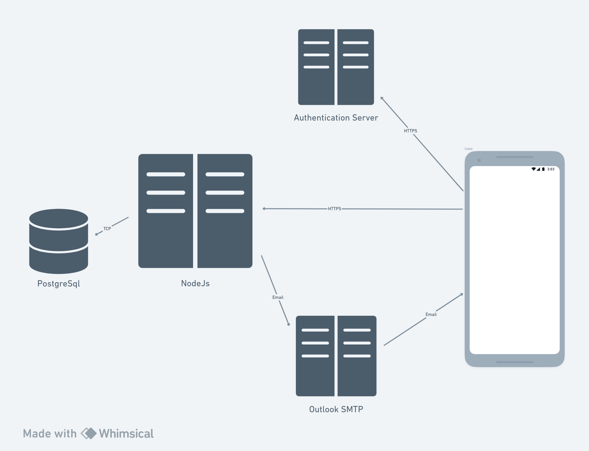

# Project Name

## Overview
This project serves as a Tech E commerce Application

## Table of Contents
- [Project Structure](#project-structure)
- [Setup and Installation](#setup-and-installation)
- [Services and Middleware](#services-and-middleware)
- [Diagrams](#diagrams)

## Project Structure
The project's directory structure is organized as follows:

```

project-root/
├── src/
│   ├── routes/
│   │   └── user.js
│   ├── middleware/
│   │   └── user.js
│   ├── models/
│   │   └── user.js
│   ├── scripts/
│   │   └── start-database.sh
│   ├── services/
│   │   ├── authentication_service.js
│   │   └── emailService.js
│   └── utils/
│       ├── jwtUtil.js
│       ├── otpUtils.js
│       ├── passwordUtils.js
│       └── responseHandler.js
├── docs/
│   ├── middleware/
│   │   └── userAuthenticationMiddleware.md
│   ├── models/
│   │   └── user.md
│   ├── routes/
│   │   └── user.md
│   ├── services/
│   │   ├── authService-doc.md
│   │   └── emailService.md
│   ├── utils/
│   │   ├── jwtUtil.md
│   │   ├── otpUtil.md
│   │   ├── passwordUtil.md
│   │   └── responseHandlerUtil.md
│   └── diagrams/
│       └── service_architecture.png
└── diagrams/
    └── service_architecture.png

```

## Setup and Installation
To set up the project locally:

```bash
git clone https://github.com/MohamedDiaaEldin/Ecommerce-tech

npm install


mkdir database 

## requires postgres docker image  
npm run start-db

# run the server
npm start
```


## Services and Middleware
- **Routes (`routes/`)**: Handles routing-related logic, including `user.js` for user-related routes.
- **Middleware (`middleware/`)**: Contains middleware files, such as `user.js`, utilized within the user-related routes.
- **Models (`models/`)**: Includes model definitions for database entities, like `user.js`.
- **Services (`services/`)**: Holds service-related logic, including `authentication_service.js` and `emailService.js`.
- **Utilities (`utils/`)**: Contains utility files, such as `passwordUtils.js`, for password-related functionalities.

## Diagrams
Represents the service architecture or system diagram.




